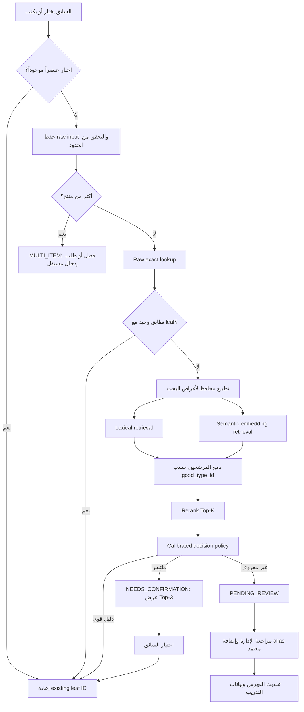

# ADR-001: آلية مطابقة وتصنيف نوع البضاعة في منصة دندن

## الحالة

تم استبداله جزئياً بـ[ADR-002](ADR-002-root-category-classification-service.md)

## التاريخ

2026-08-12

## ملخص القرار

نبني خدمة **Selective Hybrid Entity Resolution**، وليست Agent أو RAG توليدية في مسار السائق.

الخدمة تبدأ بمسار حتمي سريع، ثم تسترجع مرشحين ببحث لفظي ودلالي، ثم تعيد ترتيبهم، وأخيراً تطبق سياسة قرار معايرة تسمح للنظام بالامتناع عند الغموض. المخرج النهائي المرسل إلى التكامل الخارجي يجب أن يكون `good_types.id` موجوداً ومن فئة نهائية `leaf` فقط.

الاختيار التنفيذي للـMVP:

- كل التحقق الحرفي والتطبيع والبحث اللفظي محلي وحتمي.
- نستخدم Embedding API خلف واجهة قابلة للاستبدال لتسريع بناء الـMVP، بشرط السماح التعاقدي بإرسال نص البضاعة وحده من دون بيانات المستخدم.
- لا نستخدم Generative LLM في كل طلب، ولا نستخدم Agent أو LangGraph أو بحث الإنترنت في مسار السائق.
- في البداية، المطابقة التلقائية تكون فقط للحالات الحتمية الآمنة. البحث الدلالي يعرض أفضل 3 مرشحين للسائق ويجمع بيانات موثوقة.
- بعد توفر بيانات مراجعة كافية، نضيف reranker محلياً ونعاير عتبة المطابقة التلقائية لتحقيق الدقة المطلوبة على بيانات دندن الفعلية.

إذا كانت سياسة الإقامة أو الخصوصية تمنع Embedding API، نستبدل المحرك بموديل embedding محلي صغير خلف الواجهة نفسها؛ لا تتغير المعمارية أو عقود الـAPI.

## سياق المشكلة وقيودها

بحسب ملف التدفق وقاعدة البيانات:

- `good_types` هو المصدر الرسمي للأنواع ومعرفاتها.
- `new_good_types` يحتفظ مؤقتاً بالمصطلحات غير المحسومة لمراجعة الإدارة.
- لا يجوز إنشاء معرف رسمي جديد تلقائياً.
- لا يجوز إرسال تصنيف أب له أبناء؛ يجب أن تكون النتيجة فئة نهائية `leaf`.
- الإدخال قد يكون عربياً أو إنجليزياً أو مختلطاً، وبلهجات مختلفة، وبأخطاء إملائية، وأسماء علامات تجارية، وقد يحتوي أكثر من منتج.
- المطلوب منع إنشاء سجل جديد عندما يمكن ربط الإدخال بنوع موجود، مع إعادة المعرف الموجود فقط إلى مسار التكامل.
- الـMVP يحتاج زمناً قصيراً للبناء، واستجابة سريعة، وتكلفة قابلة للضبط، وقراراً قابلاً للتدقيق.

هذا القرار لا يبني أحكامه على اعتبار سجلات الداتا الحالية متطابقة أو غير متطابقة نصياً. الداتا الحالية تُستخدم كمصدر للكتالوج والقيود فقط، بينما جودة القرار ستُثبت لاحقاً ببيانات موسومة ومراجعة فعلية.

## صياغة المشكلة تقنياً

المسألة ليست سؤالاً وجواباً ولا تصنيفاً توليدياً مفتوحاً. هي مسألتان مترابطتان:

1. **Entity Resolution**: هل المصطلح الذي كتبه السائق يشير إلى نوع موجود أو alias معتمد؟
2. **Selective Closed-Set Classification**: إذا لم يوجد تطابق حتمي، ما أفضل فئة نهائية من الكتالوج، وهل الأدلة كافية لاتخاذ القرار أم يجب الامتناع؟

كلمة Selective مهمة: أفضل نظام هنا ليس الذي يجيب دائماً، بل الذي يجيب تلقائياً فقط عندما تكون دقته مثبتة، ويطلب تأكيداً أو مراجعة فيما عدا ذلك.

## البدائل التي تمت مقارنتها

| البديل | نقاط القوة | المشكلة في حالة دندن | القرار |
|---|---|---|---|
| قواعد حرفية وFuzzy فقط | سريع، رخيص، حتمي | لا يغطي المعنى واللهجات والعلامات التجارية جيداً | يبقى كطبقة أولى وCandidate Generator |
| مصنف ML متعدد الفئات مباشرة | سريع جداً بعد التدريب | يحتاج labels موثوقة، ضعيف مع `unknown`، ويتطلب إعادة تدريب عند تغير التصنيفات | لا يبدأ به الـMVP؛ قد يستخدم لاحقاً كمكوّن مساعد |
| LLM مباشر يختار ID | يفهم اللغة والسياق | أبطأ وأغلى، غير حتمي، وقد يخترع ID أو يبالغ في الثقة | مرفوض في hot path |
| RAG + LLM | يحصر سياق الموديل في الكتالوج | ما زال يولد قراراً ويضيف latency وتكلفة من دون حاجة للتوليد | الاسترجاع مفيد، التوليد غير مطلوب |
| Agent + LangGraph + Internet | مناسب لمسارات متعددة الخطوات وأدوات وموافقات | مبالغ فيه لطلب متزامن بسيط، والإنترنت غير موثوق كمصدر معرف رسمي | اختياري فقط لمسار الإدارة غير المتزامن |
| استرجاع هجين + reranking + abstention | سريع، قابل للقياس، مقيد بالكتالوج، يتعامل مع unknown | يحتاج بناء feedback loop ومعايرة | **الاختيار المعتمد** |

## المعمارية المختارة



### 1. المسار الحتمي السريع

1. إذا اختار السائق عنصراً من القائمة، نثق بالاختيار ونستخدم ID مباشرة بعد التحقق أنه `leaf`.
2. عند الإدخال الحر، ننفذ تطابقاً حرفياً مع `ar_name` و`en_name` والـaliases المعتمدة.
3. لا تُعتبر النتيجة حتمية إذا كان الاسم نفسه مرتبطاً بأكثر من فئة؛ تنتقل إلى مسار المرشحين.
4. نحتفظ بالنص الأصلي كما هو، وننشئ نسخة مطبعة للبحث فقط.

التطبيع المحافظ قد يشمل Unicode normalization، إزالة التشكيل والتطويل، توحيد المسافات، وتطبيع أشكال عربية محددة. لا نحذف الأرقام أو العلامة التجارية أو الكلمات التي قد تغير المعنى.

### 2. اكتشاف تعدد المنتجات

- نبدأ بقواعد واضحة للفواصل والرموز والعدادات.
- إذا بدا أن الإدخال يحوي عدة بضائع، لا نختار واحدة بصمت.
- إذا كان التكامل يقبل عدة IDs، نحل كل جزء على حدة.
- إذا كان يقبل ID واحداً فقط، يجب أن تحدد الإدارة سياسة العمل؛ هذا قرار امتثال وأعمال، وليس قرار AI.

### 3. توليد المرشحين

نولد قائمتين ثم ندمجهما:

- **Lexical**: character n-grams وBM25 أو fuzzy distance للتعامل مع الأخطاء الإملائية والتصاق الكلمات.
- **Semantic**: embedding عربي أو متعدد اللغات للمعنى واللهجة وأسماء العلامات المختلطة.

كل مستند في فهرس المرشحين يمثل `good_type_id` ويحتوي فقط على:

- الاسم العربي والإنجليزي.
- aliases المعتمدة.
- مسار الأب.
- وصف قصير معتمد إن توفر.
- علامة `isLeaf`.

نجمع النتائج حسب `good_type_id` باستخدام rank fusion، ولا نمرر آلاف aliases كقرارات مستقلة.

### 4. إعادة الترتيب

- نعيد ترتيب أفضل 5 إلى 10 فئات فقط.
- في نسخة الـMVP الأولى يمكن تأجيل الـreranker والاكتفاء بعرض Top-3.
- بعد جمع labels، نستخدم CrossEncoder صغيراً محلياً أو pairwise reranker مدرباً على أمثلة دندن.
- إذا استُخدم LLM كتجربة لاحقة، يستقبل IDs المرشحة فقط ويُسمح له بإرجاع أحدها أو `NONE`. لا يستطيع إنشاء ID، ولا تُستخدم ثقته الذاتية كاحتمال صحة.

نمط retrieve-then-rerank موثق في Sentence Transformers: الاسترجاع الأولي أسرع، ثم يعيد CrossEncoder ترتيب عدد صغير من النتائج بدقة أعلى.

### 5. سياسة القرار والامتناع

المخرجات الداخلية أربع حالات فقط:

| الحالة | المعنى | هل يوجد ID نهائي؟ |
|---|---|---|
| `MATCHED` | تطابق حتمي أو قرار آلي تجاوز العتبة المعايرة | نعم |
| `NEEDS_CONFIRMATION` | أفضل المرشحين متقاربون | لا، حتى يختار السائق |
| `PENDING_REVIEW` | لا يوجد دليل كاف أو المصطلح جديد | لا |
| `MULTI_ITEM` | الإدخال يحتوي أكثر من منتج | لا، حتى التقسيم |

لا نستخدم قيمة similarity أو confidence من LLM باعتبارها 95%. نبني `pCorrect` من بيانات مراجعة فعلية باستخدام calibrator، اعتماداً على ميزات مثل:

- نوع التطابق.
- ترتيب ودرجة الاسترجاع اللفظي والدلالي.
- درجة الـreranker.
- الفرق بين المرشح الأول والثاني.
- اتفاق محركات الاسترجاع.
- نسخة التصنيف والموديل.

نختار `T_auto` على validation set بحيث تحقق المطابقات الآلية precision لا يقل عن 95%، ويفضل أن يكون الحد الأدنى لفاصل الثقة الإحصائي أيضاً 95%. إذا لم يتحقق ذلك، تبقى المطابقة الدلالية في وضع التأكيد ولا نجبر النظام على الأتمتة.

الفرق مهم:

- **Precision**: كم قراراً آلياً كان صحيحاً؟ هذا شرط السلامة.
- **Coverage**: كم نسبة الطلبات التي عولجت آلياً؟ هذا ما نحسنه تدريجياً.

## منع التكرار بطريقة صحيحة

لا ننشئ `new_good_types` مباشرة بعد فشل التطابق الحرفي. التسلسل الصحيح:

1. إنشاء `resolution_event` idempotent لكل محاولة.
2. تشغيل جميع طبقات الاسترجاع والقرار.
3. إذا كانت النتيجة `MATCHED` أو أكد السائق مرشحاً، نعيد ID الموجود ولا ننشئ نوعاً جديداً.
4. إذا كانت `PENDING_REVIEW`، نضيف أو نحدث review item مجمعاً بالمصطلح المطبّع ونسخة التصنيف، مع زيادة `occurrence_count`.
5. تبقى كل محاولة محفوظة كحدث مستقل للتدقيق، بينما لا تمتلئ قائمة الإدارة بنسخ متكررة من المصطلح نفسه.
6. عند اعتماد الإدارة، يسجل `resolved_good_type_id` ويضاف alias معتمد وتحدث الفهارس.

## نموذج البيانات المقترح

### `good_type_aliases`

ننقل aliases تدريجياً من JSON إلى جدول علائقي قابل للفهرسة والتدقيق:

- `id`
- `good_type_id` FK
- `raw_name`
- `normalized_name`
- `language_or_dialect` nullable
- `source`: `OFFICIAL`, `ADMIN`, `DRIVER_CONFIRMED`, `MODEL_PROPOSED`
- `status`: `APPROVED`, `DISABLED`
- `approved_by`, `approved_at`
- timestamps

لا نفرض uniqueness عالمية على `normalized_name` لأن المصطلح قد يكون ملتبساً. نفرض عدم تكرار alias نفسه داخل الفئة، وأي alias يرتبط بعدة فئات لا يدخل مسار التطابق التلقائي.

### `good_type_resolution_events`

- `id`
- `client_request_id` unique للـidempotency
- `user_id` و`shipment_id` عند الحاجة
- `raw_input`
- `normalized_input`
- `taxonomy_version`
- `status`
- `resolved_good_type_id` nullable FK
- `decision_method`
- `lexical_score`, `semantic_score`, `reranker_score`, `p_correct`, `top_margin`
- `model_name`, `model_version`, `index_version`
- `latency_ms`
- `created_at`, `reviewed_at`, `reviewed_by`

### `good_type_resolution_candidates`

- `resolution_event_id` FK
- `good_type_id` FK
- `rank`
- درجات المحركات
- `was_selected`

### `new_good_types`

يمكن الحفاظ على الجدول الحالي توافقياً مع إضافة:

- `normalized_name`
- `resolved_good_type_id` nullable FK
- `status` بدلاً من الاعتماد على boolean وحده
- `occurrence_count`
- `first_seen_at`, `last_seen_at`
- `reviewed_by`, `reviewed_at`
- `resolution_reason`

## عقد الـAPI

### إنشاء محاولة حل

`POST /api/v1/good-type-resolutions`

```json
{
  "clientRequestId": "uuid",
  "rawText": "user-entered text",
  "shipmentId": "optional-id",
  "locale": "ar-SA"
}
```

استجابة مطابقة:

```json
{
  "status": "MATCHED",
  "resolutionId": "uuid",
  "goodTypeId": 122
}
```

استجابة تحتاج تأكيداً:

```json
{
  "status": "NEEDS_CONFIRMATION",
  "resolutionId": "uuid",
  "candidates": [
    { "goodTypeId": 122, "arName": "...", "enName": "..." }
  ]
}
```

### تأكيد مرشح

`POST /api/v1/good-type-resolutions/{resolutionId}/confirmation`

```json
{
  "goodTypeId": 122
}
```

يجب على الخادم التأكد أن ID كان ضمن المرشحين وأنه `leaf`.

### حد التكامل مع الوزارة

الـresolver يعيد حالة غنية للتطبيق الداخلي. أما adapter التكامل الخارجي فلا يرسل إلا:

```json
{
  "goodTypeId": 122
}
```

وذلك فقط بعد `MATCHED` أو تأكيد صريح. لا يرسل ID افتراضياً في حالات `PENDING_REVIEW` أو `MULTI_ITEM`.

يجب إلغاء استخدام ID 31 كبديل عام لأنه ليس Unknown رسمياً. إذا كان التكامل يفرض ID دائماً، يجب الحصول على Unknown ID رسمي من الجهة المالكة للتصنيف؛ وإلا يتوقف الإرسال ويطلب تدخلاً.

## المحلي مقابل API

| الطبقة | قرار الـMVP | القرار بعد ثبوت الحجم |
|---|---|---|
| Exact/normalization/lexical | محلي دائماً | محلي دائماً |
| Embeddings | API خلف adapter لتقليل زمن البناء، إذا سمحت السياسة | محلي إذا أثبت benchmark تحسن الكلفة أو latency؛ وإلا يبقى API |
| Reranker | لا يوجد أولاً؛ Top-3 confirmation | CrossEncoder محلي مدرب أو مضبوط على بيانات دندن |
| Generative LLM | خارج hot path | fallback نادر أو أداة للإدارة فقط |
| Vector DB | غير مطلوب للكتالوج الصغير؛ embeddings في الذاكرة | يضاف خلف interface فقط عند نمو الكتالوج وثبوت الحاجة بالقياس |

هذه ليست ازدواجية في القرار؛ المحرك قابل للتبديل عمداً. الـMVP يختبر جودة الحل قبل تحمل MLOps، والانتقال للمحلي لا يغير الـAPI ولا منطق القرار.

مرشحو benchmark للـembedding:

- `Swan-Small` لأنه مصمم للعربية واللهجات وتظهر ورقته تفوقاً على multilingual-E5-base في benchmark عربي عام.
- `multilingual-e5-small/base` كخط أساس متعدد اللغات بخيارات حجم مختلفة.
- `BGE-M3` كمرشح متعدد اللغات يدعم dense وsparse retrieval، مع الانتباه إلى أنه أكبر وقد لا يكون الأفضل latency للمدخلات القصيرة.

لا نختار الفائز من benchmark عام. ننفذ benchmark على gold set من دندن ونختار أفضل trade-off بين `Top-K recall`, `P95 latency`, الذاكرة، والترخيص.

## دور LangGraph والإنترنت

LangGraph موجه لمسارات طويلة وحالتية، مع persistence وhuman-in-the-loop. لذلك لا حاجة إليه في resolver المتزامن.

يمكن إضافته لاحقاً لمسار الإدارة فقط إذا أصبح المسار مثلاً:

1. مصطلح غير معروف.
2. بحث إنترنت في مصادر مسموحة.
3. استخراج اقتراح علامة أو نوع.
4. تعليق التنفيذ وانتظار موافقة الإدارة.
5. إضافة alias وتحديث الفهرس.

نتائج الإنترنت بيانات غير موثوقة، ولا يجوز أن تضيف alias أو ترسل ID بلا موافقة بشرية. يجب عزل تعليمات صفحات الويب وعدم تمريرها كأوامر للنظام.

## خطة تنفيذ الـMVP

### المرحلة 0: تثبيت العقد والقيود

**المخرجات:** قائمة invariants، سياسة المنتجات المتعددة، وسياسة unknown.

**معايير القبول:**

- كل ID نهائي موجود في `good_types` وهو `leaf`.
- لا يوجد fallback غير رسمي.
- قرار واضح بشأن قبول التكامل لأكثر من ID.

**التحقق:** contract tests ولقاء اعتماد مع مالك التكامل.

### المرحلة 1: الأساس الحتمي

**المخرجات:** aliases علائقية، resolution events، normalizer، raw exact وnormalized exact، وidempotency.

**معايير القبول:**

- اختيار القائمة يعيد ID من دون AI.
- exact match الوحيد المعتمد يعيد ID موجوداً.
- alias ملتبس لا يطابق تلقائياً.
- لا يمكن إرجاع parent ID.

**التحقق:** unit tests وDB constraints/integrity checks.

### المرحلة 2: استرجاع المرشحين وتجربة السائق

**المخرجات:** lexical retrieval، embedding adapter، rank fusion، Top-3 UI، وحالات API الأربع.

**معايير القبول:**

- فشل خدمة embedding لا ينتج ID خاطئاً؛ يعود النظام إلى lexical candidates أو review.
- كل المرشحين IDs موجودة وفئات نهائية.
- تأكيد السائق يسجل candidate ونسخة الموديل.

**التحقق:** integration tests، fault injection، وقياس P50/P95.

### المرحلة 3: الإدارة والتغذية الراجعة

**المخرجات:** review queue مجمعة، assignment، alias approval، وإعادة بناء الفهرس.

**معايير القبول:**

- اعتماد الإدارة يربط الحدث بـ`resolved_good_type_id`.
- alias المقترح لا يصبح فعالاً قبل الموافقة.
- تكرار المصطلح يزيد occurrence count ولا ينشئ review item موازياً.

**التحقق:** end-to-end test من إدخال غير محسوم إلى alias فعال.

### المرحلة 4: القياس والمعايرة

**المخرجات:** gold dataset، benchmark للموديلات، reranker، calibrator، وتقرير precision/coverage.

**معايير القبول:**

- فصل train/validation/test حسب المصطلح والزمن لتجنب تسرب الصيغ المتكررة.
- `Top-3 recall >= 95%` هدف للمرشحين.
- تفعيل auto-match الدلالي فقط إذا حقق `precision >= 95%` وفق معيار الاعتماد المتفق عليه.
- كل قرار قابل لإعادة البناء من model/index/taxonomy versions.

**التحقق:** offline evaluation ثابت وقابل للتكرار قبل كل إصدار موديل.

### المرحلة 5: تحسين الأداء والكلفة

**المخرجات:** cache، precomputed catalog embeddings، benchmark محلي مقابل API، وسياسة feature flag/rollback.

**ميزانية أداء أولية وليست نتيجة مقاسة:**

- exact/lexical service time: `P95 <= 50 ms`.
- المسار الكامل مع API embedding: `P95 <= 500 ms`.
- الهدف المحلي لاحقاً: `P95 <= 250 ms` على عتاد الإنتاج المحدد.

تُعدل هذه الأرقام بعد القياس على الخادم والشبكة الفعلية. نسجل أيضاً تكلفة كل 1000 محاولة ونسبة الطلبات التي استدعت خدمة خارجية.

### المرحلة 6: Agent إداري اختياري

لا يبدأ قبل أن تثبت المراحل السابقة أن bottleneck الحقيقي هو البحث والمراجعة اليدوية، لا دقة resolver الأساسية.

## استراتيجية البيانات والتعلم

- قرار الإدارة label ذهبي.
- اختيار السائق label فضي؛ يستخدم بعد أخذ احتمالية الخطأ بالحسبان.
- نحفظ المرشحين الخاطئين القريبين كـhard negatives للـreranker.
- لا ندرب multiclass classifier أولاً؛ pairwise reranking أسهل في التكيف مع إضافة فئات جديدة.
- نُصدر `taxonomy_version` مع كل index وموديل.
- عند تغير التصنيف، نعيد بناء embeddings ونوقف auto-match للفئات المتأثرة حتى تمر اختبارات الرجوع.

## مؤشرات النجاح

المؤشر الأساسي:

- Auto-match precision لا يقل عن 95% على test set مراجعة وغير متسربة.

المؤشرات الثانوية:

- Coverage للمطابقة التلقائية.
- Top-3 recall.
- Driver correction rate.
- Unknown false-positive rate.
- P50/P95 latency حسب كل مرحلة.
- تكلفة كل 1000 محاولة.
- حجم وعمر review queue.
- نسبة رفض التكامل الخارجي للـID.

قيود سلامة غير قابلة للتفاوض:

- 100% من IDs المرجعة موجودة و`leaf`.
- صفر IDs مخترعة.
- صفر استخدام fallback غير رسمي.
- outage خارجي لا يتحول إلى تصنيف افتراضي.
- كل قرار آلي يحمل نسخة الموديل والفهرس والتصنيف.

## المخاطر والتخفيف

| الخطر | التخفيف |
|---|---|
| تشابه فئتين وعدم وضوح الفرق | margin + confirmation بدلاً من الإجبار |
| ضعف موديل عام على لهجة أو مجال دندن | benchmark داخلي ثم fine-tune للـreranker |
| latency من API | استدعاء بعد fast path فقط، cache، timeout، fallback آمن، ثم قياس المحلي |
| تضخم التكلفة | لا LLM لكل طلب، precompute، مراقبة الاستدعاءات والكلفة |
| تغير taxonomy | versioning وإعادة فهرسة واختبارات regression |
| prompt injection من الإنترنت | الإنترنت خارج hot path، مصادر مسموحة، مخرجات مقيدة، موافقة بشرية |
| تسرب بيانات شخصية | إرسال نص المنتج فقط للخدمة الخارجية، حذف identifiers، وسياسة retention واضحة |

## الأسئلة التي تحتاج اعتماداً تجارياً أو تكاملياً

هذه الأسئلة لا تمنع بناء الأساس، لكنها تمنع التشغيل الإنتاجي الكامل:

1. هل واجهة الوزارة تقبل أكثر من `goodTypeId` للشحنة متعددة المنتجات؟
2. هل يوجد Unknown ID رسمي؟
3. هل يسمح عقد البيانات بإرسال نص البضاعة فقط إلى embedding provider خارجي؟
4. ما عتاد الإنتاج المستهدف لتجربة الموديل المحلي؟
5. من صاحب الصلاحية النهائي لاعتماد alias: إدارة دندن أم جهة التصنيف؟

## النتائج المتوقعة للقرار

### إيجابيات

- أسرع وأرخص من استدعاء LLM أو Agent لكل طلب.
- أكثر أماناً لأنه مقيد بالكتالوج ويستطيع الامتناع.
- يدعم اللهجات والأخطاء عبر الجمع بين lexical وsemantic.
- يبدأ كـMVP بسيط ثم يتحول تدريجياً إلى أتمتة عالية مبنية على labels حقيقية.
- يمكن تبديل local/API من دون تغيير التطبيقات المستهلكة.

### تكاليف وتعقيدات

- نحتاج review workflow وtelemetry منذ البداية.
- الوصول إلى 95% لا يُثبت قبل وجود test set موثوق.
- يلزم الحفاظ على taxonomy/index/model versioning.
- Top-3 confirmation يقلل الأتمتة في البداية، لكنه هو ما يبني بيانات آمنة لرفعها لاحقاً.

## المصادر الفنية

- Sentence Transformers retrieve and rerank: https://github.com/huggingface/sentence-transformers/tree/main/examples/sentence_transformer/applications/retrieve_rerank
- LangGraph overview: https://docs.langchain.com/oss/python/langgraph/overview
- Swan and ArabicMTEB: https://aclanthology.org/2025.findings-naacl.263/
- Multilingual E5 technical report: https://arxiv.org/abs/2402.05672
- BGE-M3 paper: https://arxiv.org/abs/2402.03216
