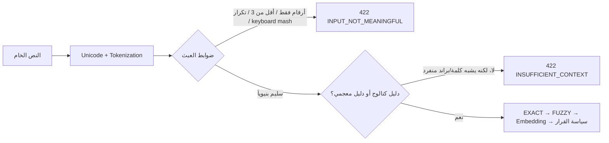

# ADR-003: بوابة جودة النص والدليل المعجمي قبل الاسترجاع

## الحالة

مقبول — 2026-08-13.

## السياق

الخدمة تصنف الوصف الحر إلى `root_good_type_id`. الـFuzzy والـEmbedding يعيدان دائماً تقريباً مرشحاً قريباً، حتى للنصوص التي لا تحمل معنى مثل `123456` أو `سسسسسس` أو `zzzz` أو خلط حروف عربي عشوائي. هذا خطر جودة: وجود مرشح لا يعني أن المدخل صالح للتصنيف.

يوجد حد منطقي مهم: لا يمكن لأي خوارزمية من الحروف وحدها أن تثبت دائماً أن كلمة جديدة هي «براند صحيح» وليست كلمة مخترعة. لذا تفصل الخدمة بين **صلاحية النص** و**كفاية السياق للتصنيف**.

## القرار

نستخدم مساراً محلياً قصيراً قبل أي `EXACT` أو `FUZZY` أو `SEMANTIC`:

### القواعد الحالية

1. كل لفظ عربي أو إنجليزي ذي معنى يجب أن يحتوي 3 أحرف على الأقل. تستثنى أداة الربط العربية `و` لأنها ليست وصفاً للبضاعة.
2. الرفض الفوري للأرقام فقط، والتكرار المتصل أو المسيطر للحرف، وتسلسلات لوحة المفاتيح الشائعة، والنص غير القابل لبناء كلمة. كاشف keyboard mash لا يرفض كلمة ثبتت بمعجم محلي أو بكتالوج دندن؛ ذلك يمنع false reject لكلمات صحيحة مثل `بلاستيك` التي قد تحتوي تسلسلاً قصيراً موافقاً لترتيب لوحة المفاتيح العربية.
3. أي اسم موجود في كتالوج دندن هو دليل كافٍ.
4. عند عدم وجود اسم كتالوج، تستخدم الخدمة [`wordfreq`](https://github.com/rspeer/wordfreq) محلياً كدليل لغوي للعربية والإنجليزية. تستعمل `zipf_frequency` بحد `2.5`، مع الاحتفاظ بالإملاء العربي قبل تطبيع `ة → ه` حتى لا يضيع الدليل المعجمي.
5. إذا لم يظهر أي دليل لكن النص مفردة لاتينية تبدو قابلة لأن تكون براند، تعيد `INSUFFICIENT_CONTEXT` بدلاً من اختراع صنف. الرسالة تطلب «نوع البضاعة + البراند/الموديل» مثل `حليب نيدو` أو `تلفزيون سامسونج`.

`wordfreq` يدعم العربية والإنجليزية ويجمع الترددات من مصادر متعددة، كما أن تردده العربي يتعامل مع التطبيع وإزالة العلامات؛ هو **إشارة** لمنع العبث وليس مصدراً للحقيقة أو قاعدة براندات. المصدر: [توثيق wordfreq](https://github.com/rspeer/wordfreq).

## البدائل التي دُرست

| الخيار | القرار | السبب |
|---|---|---|
| قواعد Regex فقط | غير كافٍ وحده | تمنع `zzzz` لكنها تمرر كلمة عشوائية ذات شكل مقبول. تبقى كأول طبقة رخيصة. |
| `wordfreq` | مستخدم الآن | يعمل محلياً للعربية والإنجليزية، ويعطي دليل تردد سريعاً من دون API خارجي. |
| [`CAMeL Tools`](https://github.com/CAMeL-Lab/camel_tools) | مؤجل | قوي للمورفولوجيا واللهجات، لكن يلزمه تنزيل data منفصل؛ وعلى Windows لا تتاح مكوّنة تحديد اللهجة. المورفولوجيا أيضاً لا تثبت أن الكلمة سلعة أو براند. |
| [`lingua-language-detector`](https://github.com/pemistahl/lingua-py) أو [fastText LID](https://fasttext.cc/docs/en/language-identification) | مؤجل | مفيدان عند توسيع اللغات. لا يحكمان على معنى الكلمة. `fastText` يوفر نموذجاً مضغوطاً 917KB لكن ترخيص نموذج اللغة CC-BY-SA، لذا لا ندخله من دون مراجعة ترخيص المنتج. |
| [`symspellpy`](https://github.com/mammothb/symspellpy) | مرحلة لاحقة | ممتاز للتصحيح الإملائي إذا أعطي معجماً وترددات موثوقين؛ لا يجوز أن يصحح وصف السائق عالمياً أو يغيّر اسم براند تلقائياً. يستخدم فقط لاقتراح تصحيح من كتالوج دندن بعد ظهور دليل. |
| [`PyArabic`](https://github.com/linuxscout/pyarabic) | غير مستخدم | يوفر تطبيعاً وتقطيعاً مفيدين، لكن ترخيصه GPL-3.0؛ لا نضيفه إلى خدمة تجارية قبل قرار ترخيص صريح. |
| Agent / LLM / بحث إنترنت | غير مستخدم في الطلب | لا يعالج الاستحالة المنطقية لبراند مجهول، ويزيد التأخر والكلفة ومخاطر الخصوصية. يصلح فقط لاحقاً كأداة إدارية offline لمراجعة حالات `INSUFFICIENT_CONTEXT`. |

## النتائج

- لا يصل النص الواضح العبث إلى RapidFuzz أو الـEmbedding؛ لذلك لا يمكن أن يخرج منه صنف بالصدفة.
- البراند الجديد مع نوع مفهوم، مثل `xenova kitchen blender`، يستمر إلى الاسترجاع الدلالي.
- البراند المفرد المجهول لا ينتج ID؛ التطبيق يطلب وصفاً إضافياً.
- أُضيفت حزمة `wordfreq>=3.1.1` (حجم تنزيل تقريبي 54MB) لتبقى المعالجة محلية وسريعة عند الطلب.
- قياس محلي بعد تحميل النموذج (30 طلباً): الوصف الدلالي P50=109.3ms وP95=141.6ms؛ النص المرفوض يتوقف قبل الفهرس P50=4.7ms وP95=28.0ms.

## خطة التحسين التالية

1. أنشئ gold set منفصل للمدخلات السليمة ولـnoise وbrand-only، ثم اضبط حد Zipf على بيانات دندن، لا على أمثلة يدوية.
2. أضف `inputQuality` تشخيصياً إلى الأحداث من دون تسجيل النص الخام، لقياس نسب الرفض والخطأ.
3. بعد توفر بيانات حقيقية، اختبر `CAMeL Tools` offline على عينة عربية/لهجية؛ أضفه فقط إن رفع recall من دون رفع false-accept بشكل ملموس.
4. إن زاد الكتالوج كثيراً، قِس `rapidfuzz.process.extract` مع `score_cutoff` و`score_hint` قبل استبدال الحلقة الحالية. توثيق RapidFuzz يذكر أن هذه الحدود تسمح بمسار أسرع: [RapidFuzz process](https://rapidfuzz.github.io/RapidFuzz/Usage/process.html).
