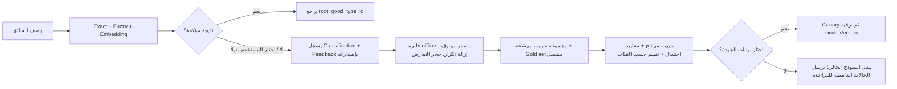

# ADR-004: التحسين المتعلم من تصحيحات التصنيف

## الحالة

مقبول — 2026-08-13.

## المشكلة

الـEmbedding والـFuzzy يسترجِعان مرشحين، لكنهما لا يملكان معرفة كاملة بكل اسم سوقي أو لهجة أو منتج جديد. لا يمكن حل ذلك بكتابة ملايين المرادفات يدوياً، ولا يجوز أن تتحول كل نقرة في الواجهة إلى تدريب مباشر؛ فاختيار السائق قد يكون خاطئاً أو غير مؤكد.

مثال اكتشفناه: كان البحث الدلالي في `كياس زباله` يضع `النفايات` أولاً، لكن تطابقاً إملائياً ضعيفاً مع كلمة عامة `اكياس` رفع `مواد غذائية` إلى المركز الأول. أصلحنا الدمج: الدليل الإملائي الضعيف يبقى دليلاً تشخيصياً/للاسترجاع، ولا يصوّت ضد دليل دلالي أقوى.

## القرار

نبني **حلقة تعلّم نشطة Human-in-the-loop**، لا Agent في مسار السائق ولا تعلماً ذاتياً فورياً.



### عقد التصحيح الحالي

`POST /v1/classifications/{requestId}/feedback` محمي بنفس API key الخاص بالخدمة.

```json
{
  "feedbackId": "uuid-unique",
  "selectedRootGoodTypeId": 141,
  "source": "DRIVER_SELECTION"
}
```

- يقبل ID لجذر موجود فقط، وليس صنفاً فرعياً.
- يسجل `requestId`، الصنف المختار، المصدر، `catalogVersion` و`modelVersion` في سجل append-only.
- لا يقبل `requestId` غير مرتبط بتصنيف مسجل (`404 CLASSIFICATION_REQUEST_UNKNOWN`)؛ فلا يمكن إنشاء label يتيم في المسار الجديد.
- `DRIVER_SELECTION` يبقى `PENDING_REVIEW`، ولا يدخل التدريب.
- `OPERATOR_REVIEW` يصبح `CANDIDATE_AFTER_VALIDATION`، وليس تدريباً مباشراً.
- `DEMO` يوثق التجربة فقط و`NOT_FOR_TRAINING`.

يجب أن يستدعي تطبيق دندن endpoint الإنتاجي من الـbackend فقط، بعد أن يتأكد من هوية صاحب التصحيح وصلاحياته. لا تستدعيه تطبيقات السائق مباشرة.

### تصدير بيانات التدريب

ينفذ كـbatch مستقل عن خدمة السائق:

```powershell
uv run python scripts\export_feedback_dataset.py `
  --events storage\events\classification_events.jsonl `
  --output storage\training\verified_feedback.jsonl `
  --report storage\training\verified_feedback_report.json
```

المصدّر يقبل التصحيحات المؤكدة فقط، ويرفض تلقائياً:

- feedback بلا classification سابق (orphan)؛
- نفس `feedbackId` أكثر من مرة؛
- طلباً له تصحيحان مؤكدان لجذرين مختلفين؛
- صفاً بلا النص الأصلي أو النص المطبع.

لا يحذف شيئاً من log المصدر؛ يخرج dataset مرشحاً وتقريراً قابلاً للتدقيق مع SHA-256 للمدخل.

كل صفّ مُصدَّر يحمل أيضاً `classificationRecordedAt` و`feedbackRecordedAt`. وجودهما يجعل الاختبار مستقبلياً بالنسبة لتاريخ التصحيح، بدلاً من تقسيم عشوائي يخلط القديم والجديد.

## التدريب بعد توفر بيانات حقيقية

1. تقسيم زمني ثابت: train / validation / test، كي لا يتسرب تكرار نفس الصياغة إلى الاختبار.
2. baseline سريع: character + word TF-IDF مع classifier متعدد الفئات؛ ذلك قوي للأخطاء الإملائية والتعريب القصير.
3. يضاف embedding كميزة أو reranker لأفضل المرشحين فقط؛ لا يكون وحده مصدراً لثقة نهائية.
4. استخدم التصحيح ليولد **hard negative**: التنبؤ السابق الخاطئ ينافس الجذر المختار في التدريب والتقييم.
5. معايرة الاحتمالات على بيانات validation منفصلة، ثم لا تقبل نتيجة تلقائياً إلا إذا حققت precision المقاس، وإلا تعيد `requiresReview=true`.

### الأداة المنفذة حالياً

`scripts/train_feedback_model.py` تبني **مرشحاً Offline فقط** من `verified_feedback.jsonl`. وهي:

1. ترفض التدريب ما لم يوجد جذران على الأقل و10 أمثلة مراجعة موثقة على الأقل لكل جذر.
2. تزيل تكرار `normalizedText`؛ وإذا ظهر النص نفسه تحت جذور مؤكدة مختلفة، تستبعده كله من التدريب.
3. تحجز أحدث 20% من كل جذر كاختبار زمني، وتدرّب على الأقدم فقط.
4. تستخدم word TF-IDF (1–2 gram) وcharacter TF-IDF (2–5 gram) مع Logistic Regression ومعايرة `sigmoid` عبر cross-validation.
5. تكتب artifact `joblib` وmetadata مستقلاً يحوي dataset hash، نسخ الكتالوج والنموذج التي جُمعت تحتها الأمثلة، إعدادات الميزات، Top-1، Top-3، ودقة النتائج ذات الثقة 90%+.

ينتهي الناتج دائماً بـ`promotionStatus: CANDIDATE_ONLY`. لا يقرأه endpoint التصنيف ولا يغيّر أوزان exact/fuzzy/embedding؛ هذه الحماية مقصودة حتى يمر النموذج بقياس ومراجعة بشرية.

### بوابة الترقية المنفذة

`app/training/promotion.py` و`scripts/evaluate_promotion.py` ينفذان gate آلياً. يحتاجان baseline منفصلاً شُغِّل على **نفس** مجموعة التقييم المجمدة (`datasetSha256`)، ويفشلان مغلقاً عند غياب أي قيمة. الحد الأدنى الحالي:

- 100 صف اختبار زمني على الأقل.
- 30 عينة عالية الثقة على الأقل، حيث الثقة 0.90 أو أعلى.
- Top-1 لا يقل عن 90% ولا يتراجع عن baseline.
- Top-3 لا يقل عن 97% ولا يتراجع عن baseline.
- Precision للقرارات ذات الثقة العالية لا يقل عن 95% ولا يتراجع عن baseline.

أمر التشغيل:

```powershell
uv run python scripts\evaluate_promotion.py `
  --candidate storage\training\candidate.metrics.json `
  --baseline storage\training\baseline.metrics.json `
  --report storage\training\promotion.report.json
```

رمز الخروج `0` يعني اجتياز البوابات، و`2` يعني رفض المرشح. القيم غير الرقمية أو غير finite مثل `NaN` و`Infinity` تفشل مغلقاً ولا تُعامل كدرجات صحيحة. حتى عند `0` لا يحدث deploy تلقائي؛ القرار التالي Canary مراقب مع rollback.

لا ندرّب الآن على بيانات مصطنعة أو على مثال واحد. يصبح التدريب ذا معنى بعد تغطية الفئات المهمة بتصحيحات مراجعة حقيقية؛ الحالات غير الواضحة تحسن العينة أكثر من المرور العشوائي على كل النصوص.

## بوابات الترقية

لا يترقى أي model artifact إلا إذا حقق على test غير مستخدم في التدريب:

1. لا انخفاض في Top-1 / Top-3 عن النموذج الحالي، وبالذات في العربية، الإنجليزية، النص المختلط، والعبارات القصيرة.
2. `Precision` للنتائج التي لا تتطلب مراجعة يحقق هدف دندن المتفق عليه (مبدئياً 95% أو أعلى) مع عينة كافية لكل شريحة.
3. لا تتراجع حالات الانحياز المعروفة: كلمات عامة مثل `كياس`، `علب`، `مواد` لا تقلب الجذر وحدها.
4. يقبل صحة schema للبيانات، hash للـdataset، modelVersion جديد، واختبار latency P95.
5. ينشر Canary على نسبة صغيرة؛ تراقب نسبة التصحيحات، نسبة review، وانجراف المدخلات، مع rollback فوري إلى artifact السابق.

## لماذا هذا هو الاختيار

الإنتاج الآمن للـML يعتمد على pipeline منفصل يجمع البيانات، يدرب، يقيّم ويقارن قبل النشر—not on an online model mutating from each input. توثق Google هذا الفصل بين serving وtraining/validation، وتوصي بمراقبة النسخ والـlatency وجودة الحالات الحية [Google ML pipelines](https://developers.google.com/machine-learning/managing-ml-projects/pipelines) و[Google monitoring](https://developers.google.com/machine-learning/crash-course/production-ml-systems/monitoring).

البحث في NLU واسع النطاق يبين أن التحقق البشري من فرضية النموذج، مع توجيه الجهد للحالات ذات الفائدة العالية، يخفض كلفة الوسم ويحافظ على الجودة؛ كما يحذر من أن self-training يستطيع تعزيز الخطأ الواثق بنفسه [Weber et al., 2021](https://aclanthology.org/2021.dash-1.2.pdf). ولأن score ليس probability موثوقة تلقائياً، تستخدم مرحلة التدريب معايرة منفصلة بالـcross-validation كما توثق [scikit-learn](https://scikit-learn.org/stable/modules/calibration.html). اختيار `sigmoid` هنا متحفظ للبيانات الصغيرة؛ توثيق scikit-learn يحذر أن `isotonic` يميل إلى overfit عندما تكون عينة المعايرة أصغر بكثير من 1000.

## النتائج

- لا حاجة لقاموس يدوي ضخم؛ التصحيحات الفعلية تصبح بيانات عالية القيمة.
- لا تسمم نقرة واحدة النموذج أو تغيّر السلوك الحي.
- يمكن شرح كل نموذج: أي catalog، أي dataset hash، وأي feedback أنتجه.
- خدمة السائق تبقى سريعة ومحلية: exact/fuzzy/embedding فقط؛ التدريب خارج مسار الطلب.
