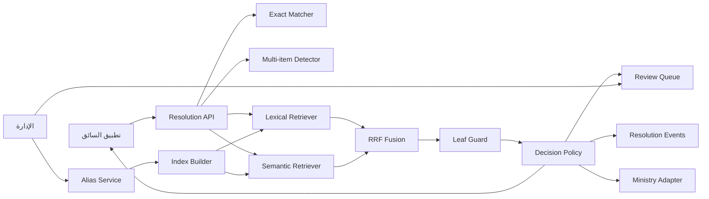

# خطة التنفيذ التفصيلية: مطابقة أنواع البضائع في منصة دندن

> النسخة المختصرة: [ملخص خطة الـMVP](001-goods-type-resolution-mvp-short.md)  
> القرار المعماري: [ADR-001](../decisions/ADR-001-hybrid-goods-type-resolution.md)

## 1. الهدف

بناء خدمة تربط النص الذي يكتبه السائق بـ`good_types.id` موجود ومن فئة نهائية `leaf`، أو تمتنع عن القرار وتطلب تأكيد السائق أو مراجعة الإدارة.

يجب أن تدعم الخدمة:

- العربية والإنجليزية والنص المختلط.
- الكلمات القصيرة من كلمة إلى ثلاث كلمات.
- الأخطاء الإملائية واللهجات وأسماء العلامات التجارية.
- منع إنشاء سجل جديد عندما يكون النوع موجوداً.
- منع إرسال ID غير موجود أو parent category.
- تسجيل كل قرار ونسخ الموديل والفهرس والتصنيف.

## 2. الحل المعتمد

```text
اختيار من القائمة
    -> التحقق من ID وleaf
    -> MATCHED

إدخال حر
    -> حفظ النص الأصلي
    -> اكتشاف تعدد المنتجات
    -> Raw/Normalized Exact Match
    -> Lexical/Fuzzy Retrieval
    -> Semantic Embedding Retrieval
    -> Reciprocal Rank Fusion
    -> Leaf Filtering
    -> Top-3 Confirmation
    -> MATCHED أو PENDING_REVIEW
```

### مكونات الـMVP

- `Normalizer` عربي محافظ.
- `ExactMatcher` للأسماء والـaliases المعتمدة.
- `LexicalRetriever` باستخدام character n-grams وfuzzy matching.
- `EmbeddingProvider` قابل للتبديل.
- `SemanticRetriever` داخل الذاكرة.
- `CandidateFusion` باستخدام RRF.
- `DecisionPolicy` مقيدة بأربع حالات.
- واجهة Top-3 للسائق.
- Review Queue للإدارة.
- Ministry Adapter يرسل ID نهائياً فقط.

### غير مطلوب في الـMVP

- Agent أو LangGraph.
- Generative LLM.
- بحث إنترنت.
- Vector Database.
- Reranker.
- Multiclass classifier.
- Semantic auto-match قبل القياس والمعايرة.

## 3. قواعد لا يمكن تجاوزها

- `good_types` هو المصدر الرسمي الوحيد للـIDs.
- النتيجة النهائية يجب أن تكون `leaf`.
- لا ينشأ ID رسمي آلياً.
- لا يستخدم ID 31 كـUnknown أو fallback.
- لا تحول cosine similarity إلى نسبة ثقة.
- تعطل خدمة embedding لا ينتج ID افتراضياً.
- الإدخال متعدد المنتجات لا يصنف كمنتج واحد بصمت.
- alias لا يصبح فعالاً قبل اعتماد الإدارة.

## 4. حالات النتيجة

| الحالة | الوصف | هل تحتوي ID نهائياً؟ |
|---|---|---|
| `MATCHED` | اختيار موجود، تطابق حتمي، أو تأكيد صريح | نعم |
| `NEEDS_CONFIRMATION` | يوجد مرشحون لكن لا يوجد تطابق حتمي | لا |
| `PENDING_REVIEW` | لا يوجد مرشح مناسب أو رفض السائق الجميع | لا |
| `MULTI_ITEM` | النص يحتوي أكثر من منتج | لا |

## 5. المعمارية



### مسؤولية كل وحدة

| الوحدة | المسؤولية |
|---|---|
| `Normalizer` | إنشاء نسخة بحث من النص دون تغيير النص الأصلي |
| `MultiItemDetector` | اكتشاف الحالات المركبة الواضحة |
| `ExactMatcher` | تطابق حتمي وحيد مع اسم أو alias معتمد |
| `LexicalRetriever` | استرجاع مرشحين قريبين إملائياً |
| `EmbeddingProvider` | إنتاج vectors فقط |
| `SemanticRetriever` | استرجاع مرشحين حسب المعنى |
| `CandidateFusion` | دمج رتب المحركين حسب ID |
| `LeafGuard` | حذف ورفض parent categories |
| `DecisionPolicy` | اختيار حالة النتيجة من دون اختراع ID |
| `ReviewService` | إدارة المصطلحات غير المحسومة والـaliases |
| `MinistryAdapter` | إرسال `{goodTypeId}` بعد MATCHED فقط |

## 6. نموذج البيانات

### 6.1 `good_type_aliases`

```text
id BIGINT PK
good_type_id BIGINT FK -> good_types.id
raw_name VARCHAR(191)
normalized_name VARCHAR(191)
language_or_dialect VARCHAR(32) NULL
source ENUM(OFFICIAL, ADMIN, DRIVER_CONFIRMED, MODEL_PROPOSED)
status ENUM(APPROVED, DISABLED)
approved_by BIGINT NULL
approved_at TIMESTAMP NULL
created_at TIMESTAMP
updated_at TIMESTAMP
```

الفهارس:

- unique على `(good_type_id, normalized_name)`.
- index على `(normalized_name, status)`.
- index على `(good_type_id, status)`.

لا يوجد unique عالمي على `normalized_name`؛ الاسم المرتبط بعدة فئات يعتبر ملتبساً ولا يطابق تلقائياً.

### 6.2 `good_type_resolution_events`

```text
id UUID/BIGINT PK
client_request_id UUID UNIQUE
user_id BIGINT NULL
shipment_id BIGINT/VARCHAR NULL
raw_input VARCHAR(191)
normalized_input VARCHAR(191)
status ENUM(MATCHED, NEEDS_CONFIRMATION, PENDING_REVIEW, MULTI_ITEM)
resolved_good_type_id BIGINT NULL FK -> good_types.id
decision_method ENUM(USER_SELECTED, RAW_EXACT, NORMALIZED_EXACT, USER_CONFIRMED, AUTO_SEMANTIC, ADMIN_ASSIGNED)
taxonomy_version VARCHAR(64)
index_version VARCHAR(64)
model_name VARCHAR(128) NULL
model_version VARCHAR(128) NULL
lexical_score DECIMAL NULL
semantic_score DECIMAL NULL
fusion_score DECIMAL NULL
p_correct DECIMAL NULL
top_margin DECIMAL NULL
latency_ms INT
reviewed_by BIGINT NULL
reviewed_at TIMESTAMP NULL
created_at TIMESTAMP
```

### 6.3 `good_type_resolution_candidates`

```text
resolution_event_id FK
good_type_id FK
rank INT
lexical_rank INT NULL
semantic_rank INT NULL
fusion_score DECIMAL
was_selected BOOLEAN
created_at TIMESTAMP
PRIMARY KEY (resolution_event_id, good_type_id)
```

### 6.4 تطوير `new_good_types`

إضافة:

- `normalized_name`
- `resolved_good_type_id`
- `status`: `PENDING`, `ASSIGNED`, `REJECTED`, `DISABLED`
- `occurrence_count`
- `first_seen_at`, `last_seen_at`
- `reviewed_by`, `reviewed_at`
- `resolution_reason`

كل محاولة تحفظ كـevent مستقل، بينما تجمع قائمة الإدارة التكرارات حسب `normalized_name + taxonomy_version`.

### 6.5 انتقال البيانات

1. إنشاء الجداول الجديدة دون حذف `common_names`.
2. Backfill الأسماء العربية والإنجليزية والـaliases الحالية.
3. جعل resolver يقرأ جدول aliases.
4. استخدام dual-write مؤقتاً إذا كان كود قديم يعتمد على JSON.
5. إزالة JSON ليست ضمن الـMVP وتحتاج migration مستقلة لاحقاً.

## 7. التطبيع

### نطبّق

- Unicode normalization.
- إزالة التشكيل والتطويل.
- توحيد المسافات.
- lowercase للاتيني.
- توحيد علامات الفصل.
- تطبيع حروف عربية محددة بعد إثباتها بالاختبارات.

### لا نطبّق تلقائياً

- حذف الأرقام.
- حذف الكلمات الإنجليزية.
- حذف البراند.
- Stemming شديد.
- تصحيح إملائي يولد كلمة جديدة.
- أي تحويل قد يدمج معنيين مختلفين.

يُحفظ النص الأصلي دائماً، وتستخدم النسخة المطبعة للبحث فقط.

## 8. البحث الحتمي

ترتيب التنفيذ:

1. إذا اختار السائق ID من القائمة، يتحقق الخادم أنه موجود وleaf.
2. البحث في النص الخام بالاسم والـalias.
3. البحث في النص المطبّع.
4. إذا كان التطابق وحيداً ومعتمداً وleaf، تكون النتيجة `MATCHED`.
5. إذا كان الاسم مرتبطاً بأكثر من فئة، ينتقل للبحث الذكي.

## 9. البحث الإملائي

الهدف هو توليد مرشحين وليس اتخاذ القرار النهائي.

المكونات:

- character n-grams، مع اختبار نطاقات مثل 2-5 و3-5.
- edit distance/fuzzy ratio.
- token overlap عندما يحتوي النص أكثر من كلمة.
- دعم العربية واللاتينية والنص المختلط.

المخرج:

```text
Top-20 aliases/categories
good_type_id
lexical_score
lexical_rank
matched_text
```

## 10. البحث الدلالي

### الموديل الأولي

- `intfloat/multilingual-e5-small` كـbaseline.
- embeddings بأبعاد 384 وفق بطاقة الموديل.
- query prefix: `query: `.
- candidate prefix: `passage: `.
- vectors normalized.

### تمثيل التصنيف

نحسب مسبقاً:

- vector لـcategory profile.
- vector مستقل لكل alias معتمد.

Category profile مثال:

```text
passage: نوع البضاعة: {ar_name}
الاسم الإنجليزي: {en_name}
الفئة الأم: {parent_path}
أسماء شائعة مختارة: {approved_aliases}
```

لا نضع قائمة aliases ضخمة في نص واحد؛ نسترجع على مستوى alias ثم نجمع حسب `good_type_id`.

### النص القصير

- النص من كلمة إلى ثلاث كلمات صالح للembedding.
- الكلمة الواحدة أقل سياقاً وأكثر غموضاً.
- في الـMVP تستخدم embeddings للاسترجاع فقط.
- لا يوجد semantic auto-match للكلمة القصيرة.

### تخزين الفهرس

- حساب catalog embeddings عند بناء الفهرس، لا لكل طلب.
- تحميل vectors في الذاكرة.
- حساب query embedding واحد لكل إدخال.
- مقارنة مباشرة بـcosine/dot product.
- لا حاجة إلى Vector Database بهذا الحجم.

### Provider قابل للتبديل

```text
embedQuery(text) -> vector
embedDocuments(texts) -> vectors
healthCheck() -> status
modelMetadata() -> name/version/dimension
```

يمكن استخدام API أو موديل محلي دون تغيير بقية النظام. القرار النهائي يعتمد على سياسة البيانات وقياس latency والكلفة.

## 11. دمج النتائج

نستخدم Reciprocal Rank Fusion لأن درجات البحث الإملائي والدلالي ليست على مقياس واحد:

```text
RRF(candidate) = 1 / (k + lexicalRank)
               + 1 / (k + semanticRank)
```

القواعد:

- تثبيت `k` في config.
- تجميع aliases حسب `good_type_id`.
- استخدام أفضل رتبة للفئة من كل محرك.
- الاحتفاظ بمصدر التطابق للتدقيق.
- حذف non-leaf candidates قبل الاستجابة.
- إعادة أفضل 3 فقط للسائق.

## 12. سياسة القرار

| الشرط | النتيجة |
|---|---|
| ID مختار وموجود وleaf | `MATCHED` |
| Raw exact وحيد ومعتمد وleaf | `MATCHED` |
| Normalized exact وحيد ومعتمد وleaf | `MATCHED` |
| توجد نتائج بحث ذكي | `NEEDS_CONFIRMATION` |
| رفض السائق كل النتائج | `PENDING_REVIEW` |
| لا توجد نتائج | `PENDING_REVIEW` |
| إدخال مركب واضح | `MULTI_ITEM` |

`AUTO_SEMANTIC` موجود كميزة مستقبلية ومعطل افتراضياً.

## 13. عقد API

### إنشاء محاولة

`POST /api/v1/good-type-resolutions`

```json
{
  "clientRequestId": "uuid",
  "rawText": "string",
  "shipmentId": "optional",
  "locale": "ar-SA",
  "selectedGoodTypeId": null
}
```

القواعد:

- إما `rawText` أو `selectedGoodTypeId`.
- النص بين 1 و191 حرفاً مبدئياً.
- `clientRequestId` يحقق idempotency.
- ID المختار يجب أن يكون موجوداً وleaf.

استجابات محتملة:

```json
{
  "status": "MATCHED",
  "resolutionId": "uuid",
  "goodTypeId": 122
}
```

```json
{
  "status": "NEEDS_CONFIRMATION",
  "resolutionId": "uuid",
  "candidates": [
    { "goodTypeId": 122, "arName": "...", "enName": "..." }
  ]
}
```

```json
{
  "status": "PENDING_REVIEW",
  "resolutionId": "uuid"
}
```

```json
{
  "status": "MULTI_ITEM",
  "resolutionId": "uuid",
  "messageCode": "SEPARATE_GOODS_REQUIRED"
}
```

لا تظهر internal scores للسائق.

### تأكيد مرشح

`POST /api/v1/good-type-resolutions/{resolutionId}/confirmation`

```json
{
  "goodTypeId": 122
}
```

يتحقق الخادم من:

- ملكية السائق للـresolution.
- الحالة الحالية `NEEDS_CONFIRMATION`.
- ID ضمن المرشحين المسجلين.
- ID ما زال leaf.
- عدم وجود تأكيد سابق متعارض.

### رفض المرشحين

`POST /api/v1/good-type-resolutions/{resolutionId}/rejection`

```json
{
  "reasonCode": "NONE_MATCH"
}
```

تتحول الحالة إلى `PENDING_REVIEW` ويحدث review item المجمع.

### الإدارة

```text
GET  /api/v1/admin/good-type-review-items
GET  /api/v1/admin/good-type-review-items/{id}
POST /api/v1/admin/good-type-review-items/{id}/assignment
POST /api/v1/admin/good-type-review-items/{id}/rejection
```

### الأخطاء

```json
{
  "error": {
    "code": "VALIDATION_ERROR",
    "message": "Invalid goods type resolution request",
    "details": {}
  }
}
```

يستخدم `503` عند تعطل provider، من دون إرجاع fallback ID.

## 14. تجربة المستخدم

### السائق

1. يختار من القائمة إن وجد النوع.
2. يكتب الاسم عند عدم وجوده.
3. يستلم MATCHED أو أفضل 3.
4. يختار مرشحاً أو "لا شيء مناسب".
5. يفصل المنتجات إذا كانت متعددة.

### الإدارة

1. تعرض pending terms مرتبة بالتكرار والعمر.
2. تعرض النصوص الأصلية والمرشحين كاقتراحات فقط.
3. تختار leaf موجوداً.
4. تعتمد alias أو ترفضه.
5. تعيد بناء الفهرس بإصدار جديد.

## 15. تحديث الفهرس

يعاد البناء عند:

- اعتماد أو تعطيل alias.
- تغيير اسم فئة.
- تغيير parent/leaf structure.
- تغيير embedding model.

النشر atomic:

1. بناء إصدار جديد.
2. تشغيل integrity checks.
3. تحميله في الذاكرة.
4. تبديل active pointer.
5. الاحتفاظ بالإصدار السابق للرجوع.

## 16. الأمن والخصوصية

- Schema validation عند حدود API.
- Parameterized queries فقط.
- مصادقة السائق والتحقق من ملكية الـresolution.
- RBAC لواجهات الإدارة.
- Rate limiting.
- حد لطول النص والـpayload.
- عدم تسجيل tokens أو secrets.
- إذا استخدم provider خارجي، يرسل نص البضاعة فقط.
- لا يرسل `userId`, `shipmentId`, الموقع أو بيانات المركبة.
- التحقق من نوع vector وأبعاده ونسخة الموديل.
- المفاتيح في secret manager/environment.
- عرض النص في الإدارة بعد escaping.

## 17. الاختبارات

### Unit

- Normalizer idempotence.
- الحفاظ على الأرقام واللاتيني.
- Exact match الوحيد.
- رفض alias الملتبس.
- Leaf guard.
- Multi-item detection للحالات الصريحة.
- Lexical ranking.
- RRF وتجميع aliases.
- Decision policy.

### Database

- Foreign keys والفهارس.
- Backfill idempotent.
- عدم فقدان canonical names.
- `clientRequestId` لا ينشئ event مزدوجاً.
- التكرار يزيد `occurrence_count`.
- Admin assignment يسجل target FK.

### Integration

- Exact -> MATCHED.
- Search -> Top-3 -> Confirmation -> MATCHED.
- Rejection -> PENDING_REVIEW.
- Provider timeout -> fallback آمن.
- Admin assignment -> index refresh -> future exact match.
- Ministry adapter يرفض الحالات غير النهائية.

### Security

- صلاحيات السائق والإدارة.
- رفض payload كبير.
- Rate limiting.
- عدم ظهور secrets في logs/errors.
- عدم استخدام SQL concatenation.

### Offline Evaluation

- قرارات الإدارة Gold labels.
- اختيارات السائق Silver labels منفصلة.
- تقسيم train/validation/test حسب العبارة والزمن لمنع leakage.
- مقارنة lexical-only وsemantic-only وhybrid.
- مقارنة E5-small وE5-base وSwan عند توفره وترخيصه.
- قياس Recall@1، Recall@3، MRR، latency، memory، cost.

## 18. مؤشرات الأداء والجودة

### الجودة

- `Top-3 Recall >= 95%` هدف للبحث الهجين.
- Semantic auto-match لا يفعل إلا إذا حقق `Precision >= 95%` على test set غير متسربة.
- قياس `Coverage` منفصلاً.
- قياس نسبة رفض السائق للمرشحين.

### الأداء

أهداف أولية وليست نتائج حالية:

- Exact/lexical: `P95 <= 50 ms`.
- المسار الكامل مع API embedding: `P95 <= 500 ms`.
- هدف المسار المحلي: `P95 <= 250 ms` بعد قياس عتاد الإنتاج.

### التشغيل

- تكلفة كل 1000 محاولة.
- Provider timeout/error rate.
- Review queue size/age.
- Ministry rejection rate.
- عدد الطلبات حسب الحالة والطريقة.

## 19. Feature Flags والرجوع

```text
goodsResolution.enabled
goodsResolution.lexicalEnabled
goodsResolution.semanticSuggestionsEnabled
goodsResolution.semanticAutoMatchEnabled=false
goodsResolution.embeddingProvider
goodsResolution.multiItemDetectionEnabled
```

خطة الرجوع:

1. تعطيل semantic auto-match فوراً.
2. تعطيل semantic suggestions.
3. العودة إلى exact + lexical + review.
4. إعادة active index إلى الإصدار السابق.
5. عدم حذف events أو migrations.
6. مراجعة القرارات المتأثرة حسب model/index version.

## 20. مراحل التنفيذ

### المرحلة 0: العقود والقرارات - 2 إلى 3 أيام

- اكتشاف stack والمستودعات.
- تثبيت أوامر build/test/lint.
- اعتماد unknown وmulti-item policy.
- اعتماد API contract.
- Benchmark صغير local مقابل API.

### المرحلة 1: الأساس الحتمي - 4 إلى 5 أيام

- Migrations وbackfill.
- Normalizer وleaf guard.
- Exact matcher.
- Event logging وidempotency.

### المرحلة 2: البحث الهجين - 4 إلى 6 أيام

- Lexical index.
- Embedding provider.
- Semantic in-memory index.
- RRF وTop-3.
- Timeouts وcache.

### المرحلة 3: السائق والإدارة - 4 إلى 6 أيام

- Top-3 confirmation UI.
- None-match flow.
- Review queue.
- Alias approval/index refresh.
- Ministry adapter guard.

### المرحلة 4: التقييم والإطلاق - 3 إلى 5 أيام

- Metrics وalerts.
- Offline evaluation.
- Security/performance tests.
- Shadow ثم canary rollout.
- Rollback drill.

التقدير الأولي: **3 إلى 4 أسابيع** لفريق صغير بعد توفر مستودعات الـbackend والـmobile.

## 21. المهام التفصيلية

### Task 0: اكتشاف stack واعتماد العقود

**القبول:**

- [ ] أوامر dev/build/test/lint موثقة وتعمل.
- [ ] سياسة Unknown والمنتجات المتعددة معتمدة.
- [ ] API response union معتمد.

**التحقق:** تشغيل أوامر المشروع وحفظ baseline.

**الاعتماديات:** لا يوجد.

### Task 1: Migrations

**القبول:**

- [ ] الجداول والحقول والفهارس وFKs موجودة.
- [ ] لا يوجد تغيير مكسّر للجداول الحالية.
- [ ] migration قابلة للتجربة والرجوع في development.

**التحقق:** up/down + schema inspection + DB tests.

**الاعتماديات:** Task 0.

### Task 2: Backfill aliases

**القبول:**

- [ ] الأسماء canonical والـaliases موجودة في الجدول الجديد.
- [ ] العملية idempotent.
- [ ] aliases الملتبسة لا تتحول إلى auto-match.

**التحقق:** reconciliation وتشغيل backfill مرتين.

**الاعتماديات:** Task 1.

### Task 3: Normalizer وLeaf Guard

**القبول:**

- [ ] التطبيع idempotent.
- [ ] النص الأصلي محفوظ.
- [ ] parent ID مرفوض مركزياً.

**التحقق:** Unit/property tests.

**الاعتماديات:** Task 0.

### Task 4: Exact Matcher وEvents

**القبول:**

- [ ] التطابق الوحيد المعتمد ينتج MATCHED.
- [ ] الاسم الملتبس ينتقل للمرشحين.
- [ ] idempotency تمنع event مزدوجاً.

**التحقق:** Unit + integration tests.

**الاعتماديات:** Tasks 1-3.

### Checkpoint A

- [ ] اختيار القائمة وexact match يعملان end-to-end.
- [ ] لا يمكن إرجاع parent أو ID غير موجود.
- [ ] Migrations/backfill/tests ناجحة.

### Task 5: Lexical Retriever

**القبول:**

- [ ] يدعم العربية واللاتينية والمختلط.
- [ ] يعيد Top-K مرشحين فقط.
- [ ] الفهرس versioned وatomic.

**التحقق:** Ranking fixtures + benchmark.

**الاعتماديات:** Tasks 2-3.

### Task 6: Embedding Provider وIndex Builder

**القبول:**

- [ ] formatting مطابق للموديل.
- [ ] dimension/version يتحقق منهما.
- [ ] فشل البناء لا يستبدل active index.

**التحقق:** Provider contract + integrity tests.

**الاعتماديات:** Task 2 وقرار المرحلة 0.

### Task 7: Semantic Retriever وRRF

**القبول:**

- [ ] النتائج مجمعة حسب ID.
- [ ] non-leaf محذوفة.
- [ ] تعطل provider لا ينتج fallback ID.

**التحقق:** Integration + fault injection + latency.

**الاعتماديات:** Tasks 5-6.

### Task 8: Resolver API

**القبول:**

- [ ] الاستجابات تطابق الحالات الأربع.
- [ ] validation/auth/rate limit تعمل.
- [ ] internal scores لا تظهر للسائق.

**التحقق:** Contract + security tests.

**الاعتماديات:** Tasks 4 و7.

### Checkpoint B

- [ ] Exact + lexical + semantic + RRF يعمل.
- [ ] Top-3 يحتوي leaf IDs فقط.
- [ ] P50/P95 مسجلة.
- [ ] Timeouts آمنة.

### Task 9: واجهة Top-3 للسائق

**القبول:**

- [ ] يمكن تأكيد مرشح واحد.
- [ ] يوجد خيار لا شيء مناسب.
- [ ] MULTI_ITEM يطلب فصل الإدخال.

**التحقق:** Mobile widget/unit + E2E.

**الاعتماديات:** Task 8.

### Task 10: Review Queue

**القبول:**

- [ ] Admin فقط يستطيع assignment.
- [ ] التكرار مجمع.
- [ ] assignment يسجل target FK وaudit data.

**التحقق:** Authorization + admin E2E.

**الاعتماديات:** Tasks 1 و8.

### Task 11: Index Refresh

**القبول:**

- [ ] إصدار جديد ينشر atomic.
- [ ] alias المعتمد يصبح exact match.
- [ ] alias المرفوض لا يصبح فعالاً.

**التحقق:** Admin assignment -> refresh -> exact E2E.

**الاعتماديات:** Tasks 6 و10.

### Task 12: Ministry Adapter Guard

**القبول:**

- [ ] يرسل `{goodTypeId}` فقط بعد MATCHED.
- [ ] يرفض الحالات غير النهائية.
- [ ] لا يستخدم ID 31 كـfallback.

**التحقق:** Contract tests مع mocks.

**الاعتماديات:** Tasks 8-9 وسياسة Unknown.

### Checkpoint C

- [ ] Text -> Top-3 -> confirmation -> external ID يعمل.
- [ ] None-match -> admin -> alias -> future exact يعمل.
- [ ] Rollback للفهرس والميزات مجرب.

### Task 13: Telemetry وEvaluation

**القبول:**

- [ ] كل قرار مرتبط بإصداراته.
- [ ] Gold/Silver labels منفصلة.
- [ ] تقارير Recall/MRR/latency/cost متاحة.

**التحقق:** Evaluation run قابل للتكرار على snapshot ثابت.

**الاعتماديات:** Tasks 8-11.

### Task 14: Security وPerformance Hardening

**القبول:**

- [ ] الأداء مقاس على بيئة ممثلة.
- [ ] لا PII/secrets في logs أو provider request.
- [ ] Auth/rate-limit/dependency checks ناجحة.

**التحقق:** Load test + security checklist + dependency audit.

**الاعتماديات:** Tasks 8-13.

### Task 15: الإطلاق التدريجي

**القبول:**

- [ ] Exact ثم semantic suggestions تطلق تدريجياً.
- [ ] Semantic auto-match يبقى معطلاً.
- [ ] Alerts/runbook/rollback مجربة.

**التحقق:** Canary report واعتماد المنتج والأمن والتكامل.

**الاعتماديات:** Task 14.

### Task 16: Semantic Auto-Match بعد الـMVP

**القبول:**

- [ ] Gold test set كافية وغير متسربة.
- [ ] Precision تحقق الهدف المعتمد.
- [ ] Calibration وfeature flag وrollback جاهزة.

**التحقق:** Offline calibration ثم shadow ثم canary.

**الاعتماديات:** Gold labels كافية وTask 15.

## 22. ترتيب الاعتماديات

```text
Task 0
  -> Task 1 -> Task 2
  -> Task 3

Tasks 1-3 -> Task 4
Tasks 2-3 -> Task 5
Task 2 + provider decision -> Task 6
Tasks 5-6 -> Task 7
Tasks 4 + 7 -> Task 8
Task 8 -> Tasks 9 + 10
Tasks 6 + 10 -> Task 11
Tasks 8-9 -> Task 12
Tasks 8-11 -> Task 13
Tasks 8-13 -> Task 14
Task 14 -> Task 15
Gold labels + Task 15 -> Task 16
```

## 23. المخاطر

| الخطر | التخفيف |
|---|---|
| غموض الكلمة الواحدة | Top-3 وعدم semantic auto-match |
| أخطاء إملائية قوية | Character n-grams + aliases + review |
| براند غير معروف | PENDING_REVIEW ثم alias معتمد |
| تشابه parent مع الإدخال | Leaf guard قبل الاستجابة والإرسال |
| Cosine مرتفعة خاطئة | ترتيب فقط ثم confirmation/calibration |
| Latency خارجي | Timeout/cache/provider قابل للتبديل |
| تضخم المراجعات | Grouping + occurrence priority + SLA |
| تغير taxonomy | Versioned atomic indexes واختبارات regression |
| تسرب PII | Text-only provider request ومراجعة أمنية |
| تعقيد مبكر | منع Agent/LLM/vector DB/reranker في MVP |

## 24. Definition of Done

- [ ] لا يعاد إلا ID موجود وleaf.
- [ ] لا يستخدم ID 31 كـfallback.
- [ ] Exact match يعمل دون AI.
- [ ] البحث الهجين يعرض Top-3.
- [ ] السائق يستطيع التأكيد أو الرفض.
- [ ] الإدارة تستطيع اعتماد alias.
- [ ] alias المعتمد يدخل الفهرس.
- [ ] Ministry adapter لا يرسل إلا MATCHED leaf ID.
- [ ] تعطل provider آمن.
- [ ] Semantic auto-match معطل في الـMVP.
- [ ] Unit/DB/Integration/E2E/Security tests ناجحة.
- [ ] P50/P95 والكلفة مقاسة.
- [ ] Metrics وalerts وrunbook وrollback جاهزة.
- [ ] OpenAPI وADR والخطتان محدثة.

## 25. المصادر الفنية

- [Sentence Transformers - Semantic Search](https://www.sbert.net/examples/sentence_transformer/applications/semantic-search/README.html)
- [Sentence Transformers - Retrieve and Re-Rank](https://www.sbert.net/examples/sparse_encoder/applications/retrieve_rerank/README.html)
- [Multilingual-E5-small](https://huggingface.co/intfloat/multilingual-e5-small)
- [Multilingual-E5 report](https://arxiv.org/abs/2402.05672)
- [BGE-M3](https://huggingface.co/BAAI/bge-m3)
- [Swan and ArabicMTEB](https://aclanthology.org/2025.findings-naacl.263/)
- [One Word Is Not Enough](https://aclanthology.org/2026.starsem-conference.32/)

