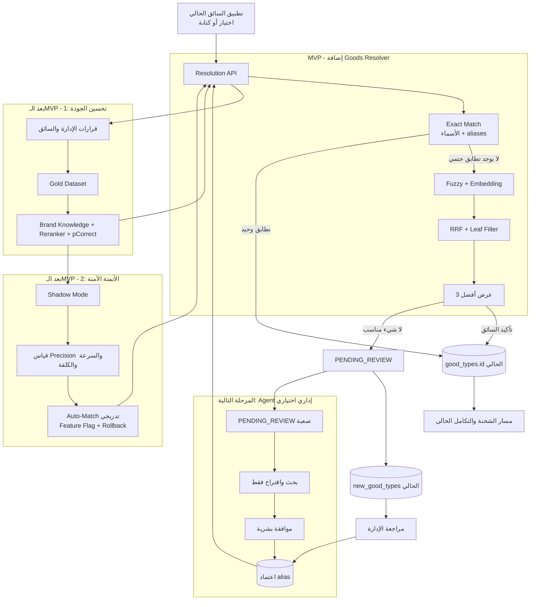

# خطة مكالمة 5 دقائق: مطابقة نوع البضاعة في دندن

## الفكرة في جملة واحدة

لن نغيّر البرنامج الحالي؛ سنضيف **Goods Resolver** بين إدخال السائق وبين إرسال `goodtype_id` أو إنشاء سجل في `new_good_types`.

## الوضع الحالي والربط المطلوب

- `good_types` هو المصدر الرسمي للأنواع والـIDs، ويحتوي الأسماء و`common_names` والعلاقة مع الفئة الأب.
- عند عدم التعرف على الإدخال، يُحفظ حالياً في `new_good_types` وتراجعه الإدارة.
- سنُبقي الجدولين والتدفق الحالي، لكننا نضيف Resolver قبل قرار المطابقة أو الإضافة الجديدة.

## المطلوب في الـMVP

1. **قاعدة البيانات:** جدول aliases معتمدة، وسجل لمحاولات المطابقة ومرشحيها، وربط المصطلح غير المحسوم بـ`resolved_good_type_id` عند مراجعته.
2. **Backend:** تطبيع محافظ، ثم Exact Match، ثم `Fuzzy + Embedding`، ثم دمج النتائج بـ`RRF` وحذف أي فئة ليست `leaf`.
3. **تطبيق السائق:** عند الغموض يعرض أفضل 3، ويستطيع السائق الاختيار أو الضغط على «لا شيء مناسب».
4. **الإدارة:** تراجع الحالات غير المحسومة، تربطها بنوع موجود، وتعتمدها كـalias للمستقبل.

نتائج الـResolver أربع فقط:

- `MATCHED`: إعادة ID موجود ونهائي.
- `NEEDS_CONFIRMATION`: عرض أفضل 3.
- `PENDING_REVIEW`: تحويل إلى الإدارة دون تخمين.
- `MULTI_ITEM`: طلب فصل المنتجات.

> لا نستخدم Agent أو LLM توليدي داخل الـMVP، ولا نستخدم `ID 31` كـUnknown أو fallback.

## المخطط

## طريقة التطبيق على البرنامج الحالي

1. إضافة migrations دون حذف الجداول أو تغيير الـIDs الحالية.
2. استدعاء `Resolution API` قبل الكود الذي ينشئ `new_good_types`.
3. عند `MATCHED` نمرر الـID إلى مسار الشحنة الحالي بلا تغيير.
4. عند `NEEDS_CONFIRMATION` يعرض تطبيق السائق أفضل 3.
5. عند `PENDING_REVIEW` نستخدم شاشة الإدارة الحالية، ثم نضيف alias ونعيد فهرسة البحث.

## ما بعد الـMVP حتى دخول الـAgent

| المرحلة | ما نضيفه | النتيجة |
|---|---|---|
| 1. تحسين الجودة | بيانات مراجعة، معرفة البراند وخط المنتج، `Reranker` ومعايرة `pCorrect` | ترتيب أدق مبني على بيانات دندن |
| 2. أتمتة آمنة | `Shadow Mode` ثم Auto-Match تدريجي بعد إثبات الدقة | تقليل تدخل السائق دون قرارات عشوائية |
| 3. Agent إداري | يبحث في الحالات الصعبة ويقترح ID موجوداً أو `NONE` | تسريع الإدارة مع بقاء الموافقة بشرية |

الـAgent لا يعمل في مسار السائق، ولا ينشئ ID، ولا يعتمد alias، ولا يرسل نتيجة للوزارة بنفسه.

## كلام جاهز موزع على 5 دقائق

**الدقيقة 1:** «حالياً `good_types` هو المصدر الرسمي، وأي اسم غير معروف يذهب إلى `new_good_types`. المشكلة أن السائق يكتب بأخطاء ولهجات وتعريب براندات، لذلك المطابقة الحرفية تنتج تكراراً أو اختياراً خاطئاً.»

**الدقيقتان 2 و3:** «سنضيف Resolver قبل إنشاء السجل الجديد. يبدأ بـExact Match، ثم Fuzzy وEmbedding لاسترجاع المرشحين، ويدمجهم ويعرض أفضل 3. إذا تأكدنا نعيد الـID الموجود، وإلا نحول الحالة للإدارة. لن نغيّر مسار الشحنة الحالي ولن نخترع ID.»

**الدقيقة 4:** «بعد الـMVP نجمع القرارات الصحيحة، ونبني معرفة للبراندات وReranker وثقة معايرة. بعدها نشغّل Auto-Match في Shadow Mode، ثم نفعله تدريجياً فقط بعد إثبات الدقة على بياناتنا.»

**الدقيقة 5:** «بعد استقرار ذلك يمكن إدخال Agent للإدارة فقط للبحث عن البراندات غير المعروفة واقتراح التصنيف، لكن القرار النهائي يبقى بشرياً.»

## القرارات المطلوبة في الاجتماع

- هل التكامل يقبل عدة IDs عند وجود أكثر من منتج؟
- هل يوجد Unknown ID رسمي؟ إن لم يوجد، نتوقف للمراجعة ولا نستخدم `ID 31`.
- هل تسمح سياسة البيانات بإرسال نص المنتج وحده إلى Embedding API؟
- بعد توفير مستودعي الـBackend وMobile نحدد نقاط الربط والمدة النهائية بدقة.

