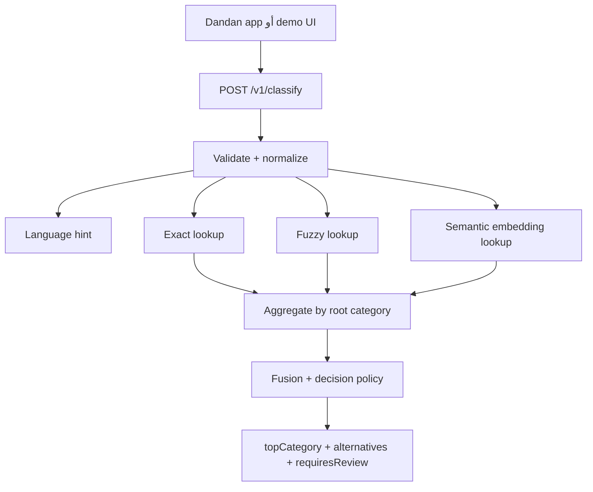

# خطة تنفيذ خدمة تصنيف الصنف الرئيسي

> النطاق النهائي: الجزء الذكي فقط. الخدمة تستقبل نصاً حراً وترجع الصنف الرئيسي من `good_types`. التطبيق الأساسي يتكفل بالباقي.

## الهدف

بناء Backend Service مستقلة مع واجهة تجريبية بسيطة. عند إدخال السائق نصاً مثل `نيدو`، `kit kat`، `كيت كات`، `مواد غزائيه`، أو نص مختلط، تعيد الخدمة أفضل صنف رئيسي موجود في قاعدة دندن.

المخرج ليس منتجاً وليس صنفاً فرعياً، بل `root_good_type_id` من الصفوف التي يكون فيها `parent_id = NULL`.

حسب ملف `sub_db.sql` الحالي:

- `good_types`: عددها `103`.
- الأصناف الرئيسية: `37`.
- أسماء الأبناء و`common_names` تستخدم كـsearch terms فقط، ثم ترفع النتيجة للجذر.

## ما ليس ضمن النطاق

- لا مطابقة منتج بعينه.
- لا إنشاء منتج أو نوع جديد.
- لا تعديل تطبيق دندن نفسه.
- لا Review Queue داخل هذه الخدمة.
- لا Agent أو LangGraph في الـMVP.
- لا بحث إنترنت في الطلب المباشر.
- لا Vector Database في الـMVP.

## الشكل العام



## API المطلوب

`POST /v1/classify`

```json
{
  "requestId": "7c6fe31e-4e9b-420a-9958-b7d81c85b7f8",
  "text": "كيت كات وشوكلاته"
}
```

استجابة ناجحة:

```json
{
  "requestId": "7c6fe31e-4e9b-420a-9958-b7d81c85b7f8",
  "catalogVersion": "2026-08-13.1",
  "modelVersion": "intfloat/multilingual-e5-small@pinned",
  "language": "MIXED",
  "topCategory": {
    "id": 12,
    "nameAr": "مواد غذائية",
    "nameEn": "Food Items",
    "rank": 1
  },
  "alternatives": [
    { "id": 12, "nameAr": "مواد غذائية", "rank": 1 },
    { "id": 5, "nameAr": "صناعية", "rank": 2 }
  ],
  "requiresReview": false,
  "reason": "EXACT",
  "latencyMs": 42
}
```

قِيَم `reason`:

- `EXACT`: تطابق حرفي واضح مع جذر واحد.
- `HYBRID_STRONG`: fuzzy وsemantic متفقان بهامش جيد.
- `AMBIGUOUS`: أكثر من صنف قريب.
- `LOW_EVIDENCE`: لا يوجد دليل كاف.
- `UNSUPPORTED_LANGUAGE`: النص بلغة خارج العربي/الإنجليزي أو غير مفهوم.
- `MULTI_CATEGORY`: النص يبدو أنه يحتوي أكثر من صنف رئيسي.
- `EMBEDDING_UNAVAILABLE`: تم استخدام المسار اللفظي فقط بسبب تعطل embedding.

الأخطاء:

- `401`: API key مفقود أو غير صحيح.
- `422`: النص فارغ أو أطول من الحد المسموح.
- `503`: لا يوجد catalog/index جاهز.

## تصميم قاعدة الخدمة

الخدمة لا تحتاج نسخ قاعدة دندن كاملة. نحتاج snapshot وفهارس تشغيل:

```text
catalog_versions
- id
- version
- source_sha256
- root_count
- term_count
- active
- created_at

root_categories
- catalog_version_id
- root_good_type_id
- name_ar
- name_en

search_terms
- catalog_version_id
- root_good_type_id
- source_good_type_id
- raw_term
- normalized_term
- source_type: ROOT_NAME | CHILD_NAME | COMMON_NAME
- language_hint
- is_cross_root_ambiguous

classification_events
- request_id
- raw_text
- normalized_text
- language
- catalog_version
- model_version
- top_root_good_type_id
- alternatives_json
- requires_review
- reason
- latency_ms
- created_at

api_clients
- name
- api_key_hash
- active
- created_at
```

الـembeddings تحفظ كملف artifact مثل:

```text
storage/indexes/{catalogVersion}/terms.npy
storage/indexes/{catalogVersion}/manifest.json
```

## آلية بناء الكتالوج

1. استيراد `good_types` من dump أو export.
2. استخراج الجذور: `parent_id = NULL`.
3. لكل صف فرعي، الصعود عبر `parent_id` حتى الجذر.
4. إضافة الاسم العربي، الاسم الإنجليزي، و`common_names` كـsearch terms.
5. حذف التكرارات داخل الجذر نفسه.
6. تعليم المصطلحات التي تظهر في أكثر من جذر كـambiguous.
7. بناء fuzzy index وembedding matrix.
8. تفعيل الإصدار الجديد فقط إذا نجحت integrity checks.

## آلية التصنيف

1. نحفظ النص الأصلي.
2. نطبّع نسخة للبحث: إزالة التشكيل والتطويل، توحيد المسافات، lowercase للاتيني، وتطبيع عربي محافظ.
3. نحدد اللغة:
   - `AR`: عربي.
   - `EN`: إنجليزي.
   - `MIXED`: عربي وإنجليزي.
   - `OTHER`: لغة أخرى أو رموز غير مفهومة.
4. إذا وجد exact match لجذر واحد، نرجع `EXACT`.
5. إذا لم يوجد، نستخدم fuzzy search.
6. بالتوازي أو بعدها نحسب embedding للنص ونقارن مع embeddings المحسوبة مسبقاً.
7. ندمج النتائج بطريقة RRF ونجمعها حسب `root_good_type_id`.
8. نرجع Top 1 دائماً عندما يوجد index، ونضع `requiresReview = true` إذا كان الدليل ضعيفاً أو اللغة غير مدعومة أو النتائج متقاربة.

## التعامل مع اللغات والبراندات

- العربي والإنجليزي والمختلط مدعومون رسمياً في الـMVP.
- أي لغة أخرى تقبل كمدخل لكن تعود بـ`requiresReview = true`.
- البراند المعروف داخل `common_names` يرجع للجذر مباشرة أو بقوة.
- البراند غير الموجود لا نجبره على صنف بثقة زائفة؛ نرجع أفضل مرشح مع `LOW_EVIDENCE` أو `AMBIGUOUS`.
- تعريب البراند مثل `كيتكات` و`كيت كات` يعالج عبر normalizer وaliases وfuzzy search، ثم semantic عند الحاجة.

## التقنية المقترحة

- Python 3.11+
- FastAPI + Pydantic v2
- Uvicorn
- SQLAlchemy + PostgreSQL أو SQLite للنسخة التجريبية
- RapidFuzz للبحث الإملائي
- SentenceTransformers مع موديل محلي مثل `intfloat/multilingual-e5-small`
- NumPy لحفظ ومقارنة embeddings
- Pytest + HTTPX للاختبارات

سبب الاختيار: FastAPI يوفر OpenAPI والتحقق بالأنواع، وSentenceTransformers يدعم semantic search و`encode_query`/`encode_document`. تحميل الموديل والفهرس يكون عبر FastAPI lifespan عند تشغيل الخدمة.

## ملفات المشروع المقترحة

```text
app/
  main.py
  api/schemas.py
  api/routes.py
  core/config.py
  core/security.py
  catalog/importer.py
  catalog/models.py
  nlp/normalizer.py
  nlp/language.py
  search/fuzzy.py
  search/semantic.py
  search/fusion.py
  classifier/service.py
  classifier/policy.py
  ui/templates/index.html
scripts/
  import_catalog.py
  evaluate_goldset.py
tests/
  test_normalizer.py
  test_catalog_import.py
  test_classifier_policy.py
  test_api_contract.py
```

## خطة التنفيذ

### المرحلة 1: تأسيس الخدمة

- إنشاء مشروع FastAPI.
- تعريف request/response schemas.
- إضافة API key auth.
- إضافة `/health` و`/v1/classify`.
- تجهيز UI عربية بسيطة للتجربة فقط.

القبول: يمكن إرسال نص واستلام response ثابت من API والواجهة.

### المرحلة 2: استيراد الكتالوج

- قراءة `good_types` من SQL dump أو export.
- استخراج 37 root categories من البيانات الحالية.
- تحويل كل child/common_name إلى `root_good_type_id`.
- بناء `search_terms`.
- حفظ catalog version.

القبول: لا يوجد term يرجع إلى ID غير جذر.

### المرحلة 3: البحث الحرفي والإملائي

- بناء normalizer.
- Exact lookup.
- RapidFuzz lookup.
- كشف الالتباس cross-root.

القبول: أخطاء مثل `مواد غزائيه` و`مواد غذايه` ترشح `12 - مواد غذائية` مع review flag حسب الدليل.

### المرحلة 4: البحث الدلالي

- تحميل موديل embedding محلي عند startup.
- بناء embeddings للمصطلحات وقت import.
- حساب query embedding لكل طلب.
- مقارنة داخل الذاكرة.

القبول: نصوص قصيرة من كلمة إلى ثلاث كلمات تعمل للاسترجاع، ولا تستخدم وحدها كـثقة نهائية.

### المرحلة 5: الدمج وسياسة القرار

- دمج exact/fuzzy/semantic على root ID.
- إرجاع Top 1 + Top 3.
- ضبط `requiresReview` و`reason`.
- منع الثقة الزائفة من cosine similarity.

القبول: كل response يحتوي `topCategory` من الجذور فقط، وflag واضح عند الغموض.

### المرحلة 6: الاختبارات والتقييم

- Unit tests للـnormalizer واللغة.
- Tests للاستيراد وعدد الجذور.
- API contract tests.
- Semantic provider mock tests.
- Gold set صغير من أمثلة حقيقية.

أهداف الجودة:

- `Top-1 Accuracy >= 90%` على test set.
- `Precision >= 95%` عندما `requiresReview = false`.
- `Top-3 Recall >= 97%`.

### المرحلة 7: التجهيز للربط مع دندن

- README وتشغيل محلي عبر `.venv` فقط.
- `.env.example`.
- Logs بدون أسرار.
- قياس P50/P95 latency.
- توثيق طريقة استدعاء API من زر "إضافة جديد".

القبول: التطبيق الأساسي يستطيع استدعاء الخدمة، واستلام `root_good_type_id`، واتخاذ قراره داخلياً.

## أوامر التشغيل المقترحة

```powershell
python -m venv .venv
.\.venv\Scripts\Activate.ps1
pip install -e ".[dev]"
python scripts/import_catalog.py --source "C:\Users\زهراء\Downloads\Telegram Desktop\sub_db.sql"
uvicorn app.main:app --reload
pytest -q
```

## Definition of Done

- API يرجع صنفاً رئيسياً فقط.
- لا يوجد product matching.
- لا يوجد Agent في مسار الـMVP.
- يدعم العربي والإنجليزي والمختلط.
- اللغات الأخرى لا تكسر الخدمة وتعود بمراجعة.
- الكتالوج versioned والفهرس يبنى بشكل atomic.
- كل نتيجة مسجلة مع `requestId`, `catalogVersion`, `modelVersion`, `reason`.
- الواجهة التجريبية تعرض النتيجة بوضوح.
- الاختبارات الأساسية ناجحة.

## المراحل بعد الـMVP

1. بناء gold dataset من قرارات دندن الفعلية ومعايرة العتبات.
2. إضافة brand dictionary وmanual aliases مع عملية اعتماد.
3. إضافة reranker محلي عند الحاجة.
4. إدخال Agent إداري فقط للحالات الصعبة، خارج مسار الطلب المباشر، ولا يعتمد أي قرار قبل موافقة بشرية.

## مراجع تنفيذية

- FastAPI lifespan لتحميل الموديل والفهرس: https://fastapi.tiangolo.com/advanced/events/
- SentenceTransformers semantic search: https://www.sbert.net/examples/sentence_transformer/applications/semantic-search/README.html
- موديل baseline: https://huggingface.co/intfloat/multilingual-e5-small
