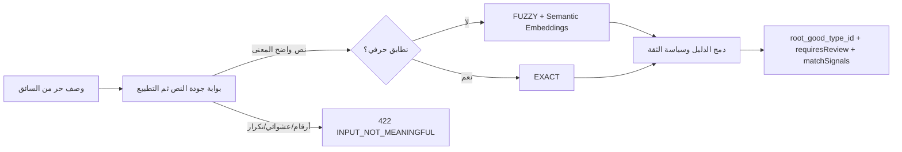
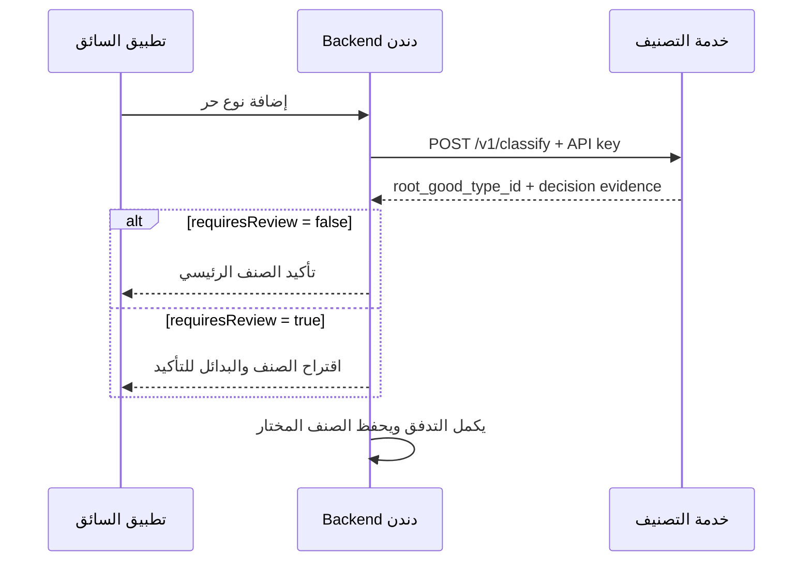

# تدقيق خدمة تصنيف الصنف الرئيسي وخطة ربطها بدندن

**الحالة:** مناسبة لعرض الـMVP والربط الداخلي المحدود، وليست جاهزة بعد للنشر العام دون إغلاق بنود الإنتاج أدناه.

## ما تفعله الخدمة فعلياً



- `EXACT`: اسم موجود في الكتالوج بعد التطبيع؛ لا يُشغّل embedding.
- `FUZZY`: اختلاف إملائي أو صياغي مقارنةً بمصطلحات الكتالوج.
- `SEMANTIC`: مقارنة متجه النص مع وثائق مبنية تلقائياً من الجذور والأبناء و`common_names`.
- `HYBRID`: المحركان التقريبي والدلالي دعما الصنف الفائز.
- **بوابة جودة النص:** تُنفّذ قبل أي Fuzzy أو Embedding: لا تقبل أرقاماً فقط، وكل لفظ عربي/إنجليزي يجب أن يكون 3 أحرف على الأقل، وترفض تكرار الحرف بشكل مفرط وتسلسل أزرار لوحة المفاتيح والنص غير القابل للتعرّف. تستعمل أيضاً دليلاً معجمياً محلياً للعربية/الإنجليزية. تعيد `422 INPUT_NOT_MEANINGFUL` للعبث و`422 INSUFFICIENT_CONTEXT` للبراند المفرد المجهول؛ في الحالتين يطلب التطبيق إعادة إدخال وصف أوضح.

لا يوجد Agent أو بحث إنترنت في الطلب؛ لذلك زمن الاستجابة قابل للتوقع ولا توجد كلفة API خارجية لكل سائق.

## نتيجة التدقيق

### نقاط سليمة

- العقد واضح: الخدمة تعيد الصنف الرئيسي فقط، ولا تنشئ منتجاً أو صنفاً جديداً.
- التطبيع والتطابق الحرفي يسبقان البحث الدلالي، وهذا أسرع وأدق للحالات المعروفة.
- الفهرس صغير ومحلي، وcache للـembeddings يمنع إعادة بنائه عند كل تشغيل.
- القرار المحافظ موجود: `requiresReview=true` عند الغموض أو ضعف الدليل.
- `matchSignals` الآن يوضح بدقة محركات البحث التي دعمت **المرشح الفائز**.
- النصوص العبثية لا تصل إلى الفهرس الدلالي أو التقريبي، فلا يمكن أن تتحول بالصدفة إلى صنف مقبول.
- اختبارات العقد والمنطق موجودة، ومنها اختبار ألا تطغى fuzzy ضعيفة على semantic أقوى.

### تم إصلاحه في هذه المراجعة

- أُضيف `matchSignals` إلى `POST /v1/classify` لتفسير المسار.
- واجهة الديمو صارت تعرض القرار والدليل والبدائل بدلاً من JSON خام فقط.
- الديمو أصبح معطلاً افتراضياً (`DANDAN_DEMO_ENABLED=false`).
- لم يعد `modelVersion` يكشف مسار الجهاز المحلي.
- خُفّض حجم `ROOT_PROFILE` إلى 70 مثالاً كحد أقصى؛ القياس على الكتالوج الحالي: أكبر profile صار 482 token تحت حد الموديل 512.

### بنود يجب إغلاقها قبل الإنتاج

1. **Gold set حقيقي:** اجمع 300–500 وصف من دندن مع الصنف الصحيح. لا تضبط أوزان fusion أو threshold على أمثلة يدوية فقط.
2. **بوابة الخدمة:** اجعلها داخل شبكة خاصة أو API Gateway، بمفتاح محفوظ في Secret Manager، HTTPS، rate limit، وتدوير للمفتاح.
3. **المراقبة:** اجمع P50/P95 latency ونسب `EXACT/FUZZY/SEMANTIC/HYBRID` و`requiresReview` لكل نسخة كتالوج وموديل.
4. **التغذية الراجعة:** عند تصحيح موظف لنتيجة تحتاج مراجعة، خزّن `(النص، root الصحيح، version)` في gold set؛ لا تضف alias ثابتاً تلقائياً.
5. **استيراد الكتالوج:** الاستيراد الحالي مهيأ لهيئة SQL dump الحالية. في الإنتاج استبدله بـexport JSON/CSV مضبوط من قاعدة بيانات دندن أو API داخلي موقّع؛ لا تجعل parser النصي جزءاً من مسار الطلب.
6. **السجل:** سجّل أقل قدر ممكن وطبّق retention/rotation لملف الأحداث. لا تسجّل API key أو النص الخام من دون قرار خصوصية صريح.

## خطة الربط من التطبيق الأساسي

لا يستدعي تطبيق الموبايل هذه الخدمة مباشرة. Backend دندن هو العميل الوحيد لها.



### طلب backend دندن

```http
POST /v1/classify
X-API-Key: <secret-from-server-only>
Content-Type: application/json

{"requestId":"uuid-generated-by-dandan","text":"تلفزيون ذكي 65 بوصة"}
```

### ما يعتمد عليه Backend دندن

| الحقل | التصرف |
|---|---|
| `topCategory.id` | الصنف الرئيسي المقترح؛ هذا هو `root_good_type_id`. |
| `requiresReview=false` | يقبل الاقتراح تلقائياً حسب سياسة دندن. |
| `requiresReview=true` | يطلب تأكيد السائق أو موظف؛ لا يحوّل الاقتراح إلى حقيقة نهائية. |
| `alternatives` | يعرض حتى 3 بدائل عند التأكيد. |
| `catalogVersion`, `modelVersion` | يسجلان مع القرار لتتبّع الجودة بعد أي تحديث. |
| `matchSignals` | للتدقيق والـobservability، وليس شرطاً لمنطق التطبيق الأساسي. |

### الأخطاء وretry

- `200`: النتيجة صالحة، حتى إن كانت `requiresReview=true`.
- `401`: خطأ إعداد/مفتاح؛ لا تُعد المحاولة آلياً.
- `422`: نص غير صالح/عبث (`INPUT_NOT_MEANINGFUL`) أو براند مجهول بلا نوع (`INSUFFICIENT_CONTEXT`)؛ اعرض رسالة إعادة الإدخال ولا تعِد المحاولة. أمثلة: `123456`، `سسسسسس`، `zzzz`، أو `qazmori` وحدها.
- `503` أو timeout: retry واحد قصير من Backend فقط، ثم انتقل لاختيار يدوي/طابور مراجعة. لا تعيد الإرسال بلا حدود.
- timeout المقترح للـMVP: **800ms** داخل الشبكة. التطبيق لا ينتظر الخدمة مباشرة؛ Backend يعيد حالة مناسبة للواجهة.

## كيف أتأكد من نوع البحث المستخدم؟

افحص `matchSignals.methods` في الاستجابة:

| القيمة | المعنى |
|---|---|
| `["EXACT"]` | تطابق حرفي فقط؛ الـembedding لم يعمل لهذه النتيجة. |
| `["FUZZY"]` | بحث تقريبي/إملائي فقط؛ راجع النتيجة قبل قبولها تلقائياً. |
| `["SEMANTIC"]` | الـembedding هو الدليل المتاح للصنف الفائز. |
| `["FUZZY", "SEMANTIC"]` | تم دمج المسارين؛ هذا هو `HYBRID` عندما تحقق threshold الثقة. |

مثال:

```json
"matchSignals": {
  "methods": ["FUZZY", "SEMANTIC"],
  "evidence": [
    {"method": "FUZZY", "matchedTerm": "تلفزيونات", "score": 0.9, "rank": 1},
    {"method": "SEMANTIC", "matchedTerm": "الإلكترونيات", "score": 0.8563, "rank": 2}
  ],
  "matchedTerms": ["تلفزيونات", "الإلكترونيات"],
  "maxEvidence": 0.8563,
  "scoreMargin": 0.0555
}
```

`maxEvidence` و`scoreMargin` إشارات تشخيصية نسبية؛ لا ينبغي أن يكتب Backend دندن قواعد قبول مستقلة عليها. القرار الرسمي للخدمة هو `requiresReview` و`reason`.

## قياسات محلية حالية

- 37 صنفاً رئيسياً، 2308 مصطلحات كتالوج، و2382 وثيقة embedding.
- أول بناء للفهرس المحلي: نحو 34 ثانية؛ إعادة التشغيل مع cache: نحو 2.66 ثانية.
- طلبات محلية بعد جاهزية الفهرس: P50=109.3ms وP95=141.6ms في قياس 30 طلباً محلياً بعد إضافة الدليل المعجمي. النص المرفوض يتوقف قبل الفهرس: P50=4.7ms وP95=28.0ms.

قبل الإنتاج، قِس P50/P95 تحت حمل مماثل لعدد طلبات دندن. لا تشغّل عدة workers على جهاز محدود الذاكرة بلا قياس؛ كل worker يحمل موديل CPU محلياً.
